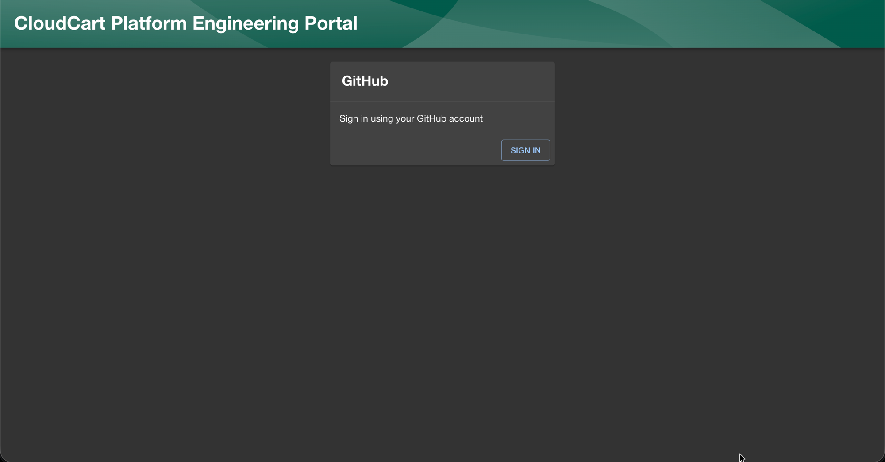
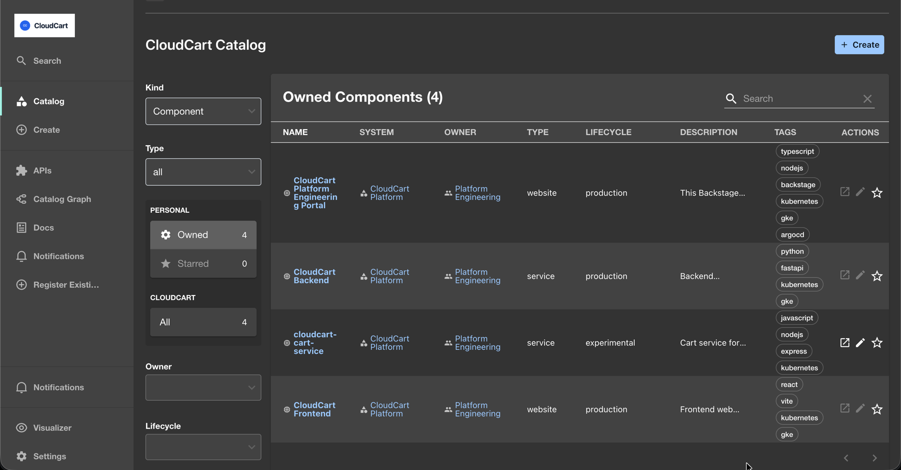
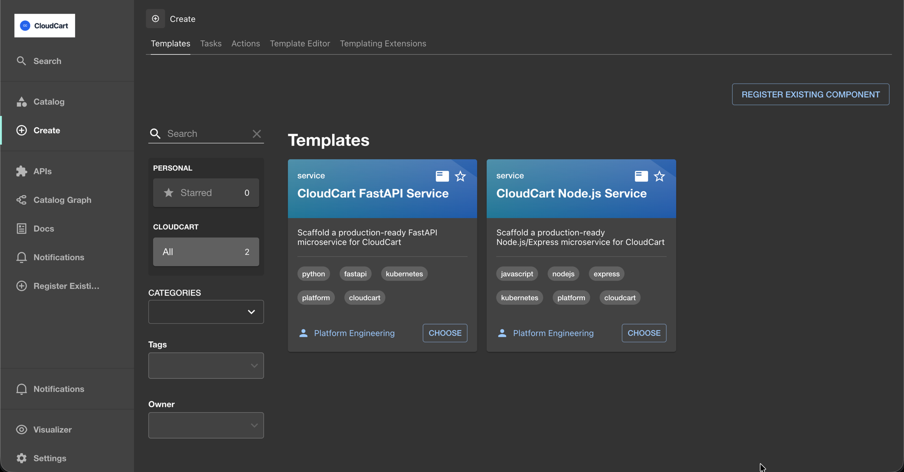
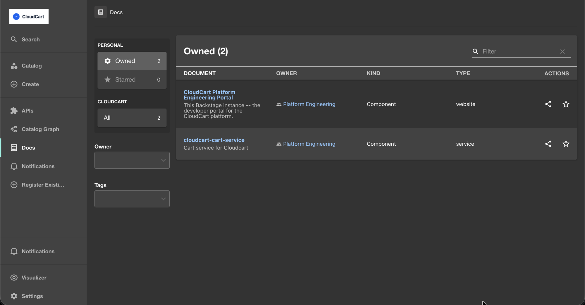
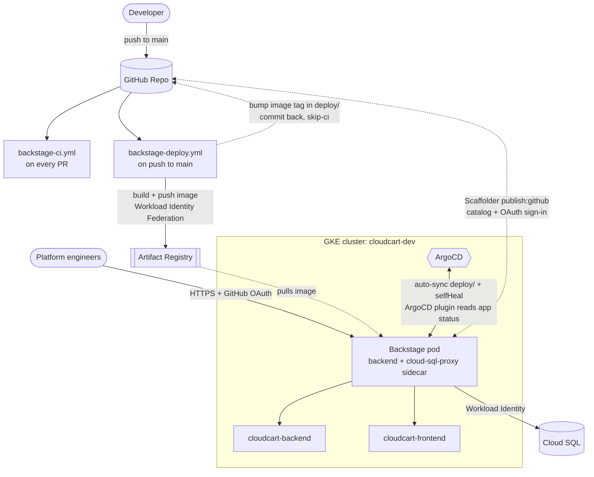

# CloudCart Platform Engineering Portal

An internal developer platform built on [Backstage](https://backstage.io), running on Google
Kubernetes Engine (GKE). It's the single place CloudCart engineers go to find what services
exist, who owns them, how they're deployed, and how to spin up a new one.

[](https://github.com/ravisinghrajput95/platform-engineering-idp/actions/workflows/backstage-ci.yml)
[](https://github.com/ravisinghrajput95/platform-engineering-idp/actions/workflows/backstage-deploy.yml)
[](https://github.com/ravisinghrajput95/platform-engineering-idp/actions/workflows/techdocs-build-check-demo.yml)



## Features

- **Software Catalog** -- CloudCart's system, services, API, and shared Postgres resource,
  modeled as Backstage entities with ownership.
- **Golden-path scaffolder templates** -- self-service "Create" flow that generates a new
  service (FastAPI or Node.js/Express today), complete with Dockerfile, Kubernetes manifests,
  `catalog-info.yaml`, and TechDocs, then publishes it to a new GitHub repo and registers it in
  the catalog automatically.
- **TechDocs** -- docs-as-code, built on demand from each service's own `mkdocs.yml`, with a
  reusable CI workflow (`techdocs-build-check.yml`) any repo can adopt to catch a broken nav or
  bad build before merge.
- **Kubernetes plugin** -- live pod/deployment status from the `cloudcart-dev` GKE cluster,
  surfaced directly on a component's page.
- **ArgoCD plugin** -- sync status and deploy history for ArgoCD-managed components.
- **GitHub Actions plugin** -- workflow runs, job steps, and logs for any component with a
  `github.com/project-slug` annotation.
- **GitHub OAuth sign-in** -- no guest login; identity resolves to catalog `User` entities.
- **GitOps deployment** -- CI builds and pushes an image; ArgoCD (not CI) applies it to the
  cluster, with `selfHeal`/`prune` enabled.

## Screenshots

<table>
<tr>
<td width="50%">

**Software Catalog**

CloudCart's components, systems, and a service scaffolded from the Node.js template, all with ownership and lifecycle metadata.

</td>
<td width="50%">

**Create — golden-path templates**

Both scaffolder templates (FastAPI and Node.js/Express) ready to self-service a new CloudCart microservice.

</td>
</tr>
<tr>
<td colspan="2">

**TechDocs**

Docs built on demand from each service's own `mkdocs.yml`.

</td>
</tr>
</table>

## Architecture



See [`docs/architecture.md`](backstage/docs/architecture.md) for the details behind this
diagram -- TLS, identity, and how the Kubernetes plugin authenticates -- and
[`docs/cicd.md`](backstage/docs/cicd.md) for the full CI/CD pipeline writeup.

## Tech stack

| Layer | What |
|---|---|
| Portal | Backstage (TypeScript/Node), plugins: catalog, scaffolder, techdocs, kubernetes, [ArgoCD (Roadie)](https://roadie.io/backstage/plugins/argo-cd/), github-actions |
| Runtime | Google Kubernetes Engine, 2-replica Deployment (soft anti-affinity + PodDisruptionBudget) + LoadBalancer Service |
| Database | Cloud SQL (Postgres), reached via the Cloud SQL Auth Proxy sidecar |
| CI/CD | GitHub Actions, Workload Identity Federation (no stored GCP keys), ArgoCD (GitOps, `automated: {prune, selfHeal}`) |
| Registry | Google Artifact Registry |
| Docs | TechDocs, MkDocs, built in-process (no Docker-in-Docker) |
| Local dev parity | Docker Compose mirroring the GKE deployment (see below) |

## Repository structure

```text
platform-engineering-idp/
├── backstage/
│   ├── packages/            # app (frontend) + backend workspaces
│   ├── catalog/              # System/Component/Resource/API/Group entities
│   ├── templates/             # Scaffolder golden-path templates
│   │   ├── cloudcart-fastapi/
│   │   └── cloudcart-nodejs/
│   ├── deploy/                # Plain k8s manifests, applied by ArgoCD
│   ├── docs/                  # TechDocs source (this portal's own docs)
│   ├── scripts/                # gen-local-tls.sh
│   ├── app-config.yaml         # Base config (dev defaults)
│   ├── app-config.production.yaml   # GKE overrides (HTTPS, Postgres, kubernetes/argocd)
│   ├── app-config.local-container.yaml  # docker-compose override (baseUrl only)
│   └── docker-compose.yaml
├── .github/workflows/         # backstage-ci, backstage-deploy, techdocs-build-check(-demo)
├── docs/images/                # README assets
└── README.md
```

## Getting started

Two ways to run this locally, depending on what you're doing:

### Fast path: `yarn start`

Hot-reload dev server -- SQLite, plain HTTP, no Postgres/TLS setup. Best for day-to-day
frontend/backend work.

```bash
cd backstage
yarn install
yarn start
```

- Frontend: http://localhost:3000
- Backend: http://localhost:7007

### Prod-parity path: Docker Compose

Same backend image and config layering as the actual GKE deployment -- real Postgres via the
`pg` client, HTTPS with a persistent self-signed cert, same `kubernetes`/`argocd` config. Use
this when you need to reproduce something that only shows up under prod-like conditions.

```bash
cd backstage
yarn install --immutable && yarn tsc && yarn build:backend
./scripts/gen-local-tls.sh
cp .env.example .env   # fill in GITHUB_TOKEN, AUTH_GITHUB_CLIENT_ID/SECRET, POSTGRES_PASSWORD
docker compose up --build
```

Then open `https://localhost:7007` (click through the self-signed cert warning) and sign in
with GitHub. Full details, including what's identical to prod vs. swapped, and the known
Kubernetes/ArgoCD connectivity gaps, are in
[`docs/local-development.md`](backstage/docs/local-development.md).

## Documentation

Full docs are served through this portal's own TechDocs tab, and also readable directly:

- [Architecture](backstage/docs/architecture.md) -- how the Backstage instance itself is deployed
- [CI/CD Pipeline](backstage/docs/cicd.md) -- commit to running pod, end to end
- [Software Catalog](backstage/docs/catalog.md) -- how services are modeled, and how to onboard a new one
- [TechDocs](backstage/docs/techdocs.md) -- how this docs system is configured
- [Local Development](backstage/docs/local-development.md) -- the Docker Compose setup

## License

No license file is included -- this is a personal/portfolio project (`UNLICENSED` in
`package.json`), not licensed for reuse.
